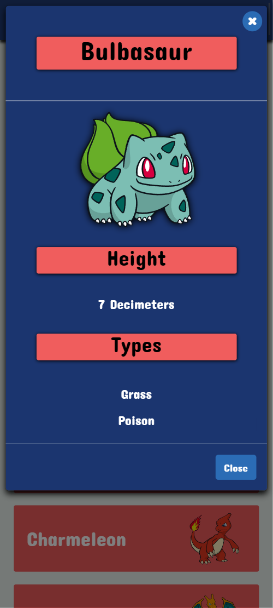

# Pokedex

## Table of Contents

- [Description](#description)
- [Technical Requirements](#technical-requirements)
- [Optional Requirements](#optional-requirements)
- [Pokemon List (Desktop)](#pokemon-list-desktop)
- [Pokemon List (Mobile)](#pokemon-list-mobile)
- [Pokemon Modal](#pokemon-modal)

## Description

The objective of this exercise was to build a small application with HTML, CSS, and JavaScript that loads data from an external API and enables the detailed viewing of data points. Users can view a list of Pokemon and see more details for each one. Additionally, users can Search the  Pokemon list by name and filter the list by type. 

The key features include:
- Loading Data from an External API
- Viewing a List of Items
- On clicking a Pokemon, view the relevant details

## Technical Requirements
- The app will load data from the Pokemon API (https://pokeapi.co/api/v2/pokemon/)
- The app will display a list of Pokemon loaded from the API.
  - The list will include the Pokemon's name and image
- The app will enable the user to view additional details for each Pokemon on demand by clicking on the Pokemon tile
-  The app has CSS styling using Bootstrap
-  The app uses Javascript linted with ESLint rules and formatted by Prettier
-  The app uses at least one additional complex UI Pattern
   - I used modals to display the Pokemon details
- The app works in Chrome, Firefox, Safari, and IE11

## Optional Requirements
- The app shows a loading Indicator while loading data
- The app loads a single page of data from the API. It loads the next page on scroll until all Pokemon are loaded (up to a defined limit)
  - Referenced https://webdesign.tutsplus.com/infinite-scroll-pagination-with-javascript-and-a-rest-api--cms-93560a for help and inspiration on coding page load by scroll
  - The search and filter functions will pull the entire list of Pokemon (if they are not loaded), then perform the search/filter

## Pokemon List (Desktop)
The following image shows the Pokedex's mobile version. The Pokemon will be displayed in three columns

### Pokemon List (Mobile)
The following image shows the Pokedex's mobile version. Each Pokemon will be loaded in a single column

### Pokemon Modal
The modal will display an image of the Pokemon along with its height and Type

